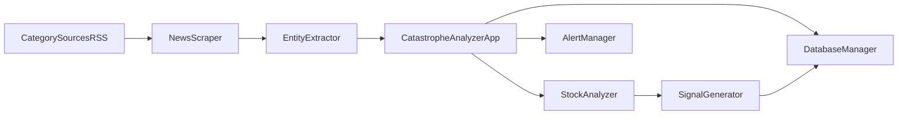

# Architecture

## Purpose

Catastrophe Analyzer is a deterministic event-to-signal system for public equities.

It converts category-specific news into structured events, scores likely financial stress, evaluates post-event technical behavior, and emits rule-based trade signals.

## System flow

## Runtime modes

- CLI mode: `src/main.py`
  - Used for manual inspection and debugging.
- Service mode: `src/monitor.py`
  - Continuous loop used by Docker live service.

## Core modules

- `news_scraper.py`
  - Pulls configured feeds by category.
  - Applies keyword filtering.
  - Normalizes publication times and deduplicates links.

- `entity_extractor.py`
  - Extracts company mentions from titles/summaries.
  - Resolves listed tickers (US-listing constrained).

- `main.py` (`CatastropheAnalyzerApp`)
  - Runs ingest -> extract -> watch creation.
  - Applies category-aware subtype/severity heuristics.
  - Applies financial distress likelihood scoring and watch gating.
  - Runs analysis and signal generation for active watches.

- `stock_analyzer.py`
  - Computes event-centric price metrics (drop, recovery, RSI, MA, volume).

- `signal_generator.py`
  - Generates/ranks rule-based signals from analysis output.

- `database_manager.py`
  - Persists canonical CSV artifacts (`events`, `watchlist`, `analysis`, `signals`, `timeseries`).

- `alert_manager.py`
  - Sends notifications for new signals (stdout + optional ntfy/email/Twilio).

## Data model (high level)

- Event: ticker, company, event date, event category, subtype, severity, source, summary.
- Watch: active candidate for post-event monitoring.
- Analysis: technical context around event date.
- Signal: ranked rule-based trade opportunity.

## Category model

Categories are configured in `config/settings.json` under `event_categories` and attached per source in `news_sources`.

Current deep categories:

- `cybersecurity`
- `clinical_regulatory_binary`
- `product_safety_recall`

Future category ideas remain in `docs/EVENT_CATEGORIES_AND_IMPACT.md`.

## Distress scoring and gating

`main.py` computes a heuristic financial distress score per article:

- Output: score `0-100`, likelihood (`LOW`/`MEDIUM`/`HIGH`).
- Gate: watch creation requires minimum score from `settings.json -> distress_model`.
- This reduces low-impact noise entering active watchlists.

## Deployment

Docker is the canonical live runtime:

- `Dockerfile` installs deps, copies repo, sets `WORKDIR /app/src`.
- Entry: `python -u monitor.py`.
- Mount `config/` and `data/` so settings and records persist outside the container.

## Design principle

Keep the scripted pipeline as the system of record.

Agents/LLMs can be used as optional enrichers, but ingestion, event records, and signal generation should remain reproducible from code/config.
