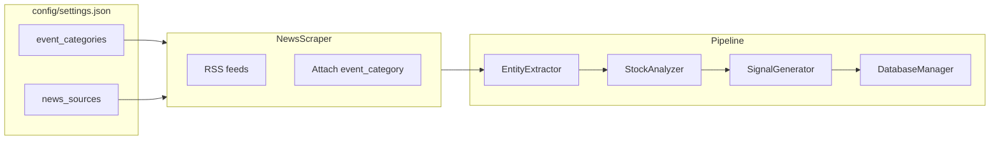

# Multi-category implementation plan (Phase 1 and beyond)

**Status:** Product direction and docs are updated; **code is still largely breach-named** until this plan is implemented. Use this file plus [EVENT_CATEGORIES_AND_IMPACT.md](EVENT_CATEGORIES_AND_IMPACT.md) when continuing in a new chat.

## Product goal

Across **event categories** (cyber, leadership scandal, supply disruption, regulatory, M&A, etc.), reuse one pipeline: **news → ticker → price/RSI/volume around event date → rule-based signals → persistence/alerts**. More categories → more independent watch reasons for dip-style setups (not financial advice).

## Terminology

- Use **`event_categories`** (config) and **`event_category`** (per article / CSV row). Do **not** call these “buckets” in new code or config.
- **`event_subtype`** replaces today’s breach-type heuristics per category (e.g. ransomware vs data breach for cyber).

## Category roadmap

Canonical ids and the full **news → price impact** table: [EVENT_CATEGORIES_AND_IMPACT.md](EVENT_CATEGORIES_AND_IMPACT.md).

| Phase | `event_category` | Notes |
|-------|------------------|--------|
| **1** | `cybersecurity` | Only category **enabled** at first; current RSS + keywords + entity heuristics. |
| **2+** | `leadership_scandal`, `supply_chain_disruption` | New feeds, keywords, extraction tuning. |
| **2+** | `clinical_regulatory_binary`, `product_safety_recall`, `fraud_accounting_enforcement`, `financial_distress`, `dilutive_financing`, `ma_corporate_action`, `positive_earnings_catalyst` | Stub in config until sourced; often need non-security RSS or APIs. |

**Config:** `settings.json` should define **all** ids with `enabled: false` except `cybersecurity`, each with `keywords: []` (fill over time).

## Architecture (target)

## Implementation checklist (Phase 1)

- [ ] **`config/settings.json`**: Add `event_categories` with full id stubs; move cyber keywords out of Python into `cybersecurity.keywords`; add `event_category` on each `news_sources` entry; rename `breach_watch` → `event_watch` (read old key as fallback).
- [ ] **`src/news_scraper.py`**: Load keywords from config; tag each article with `event_category`; skip sources whose category is disabled.
- [ ] **`src/database_manager.py`**: New CSV names (`events.csv`, `event_watchlist.csv`, `event_price_timeseries.csv`); new column names (`event_date`, `event_category`, `event_subtype`, etc.); **one-time migration** from legacy `breach*.csv` → set `event_category='cybersecurity'`; prefer uniqueness **`(ticker, event_date, event_category)`** on watchlist.
- [ ] **`src/main.py`**: Thread `event_category` through detection/watchlist/DB; rename user-facing strings and methods toward “events” where generic (`detect_new_events`, etc.).
- [ ] **`src/stock_analyzer.py`**: `event_date` / `analyze_event_impact` (or new API + thin alias).
- [ ] **`src/signal_generator.py`**: Align dict keys with analyzer (`event_date`, `volume_spike_at_event`).
- [ ] **`src/alert_manager.py`**: Include category in alert text when present.
- [ ] **`src/entity_extractor.py`**: Optional `event_category` argument for future branching; cyber patterns remain default for Phase 1.
- [ ] **Smoke:** `python main.py` from `src/` (options 1–2) or `python monitor.py --once`; confirm migrated CSV headers and ingested rows.

## CSV migration (legacy → neutral)

| Legacy | New |
|--------|-----|
| `breaches.csv` | `events.csv` |
| `breach_watchlist.csv` | `event_watchlist.csv` |
| `breach_price_timeseries.csv` | `event_price_timeseries.csv` |

Column renames (conceptual): `breach_type` → `event_subtype`; `breach_date` → `event_date`; `pre_breach_price` → `pre_event_price`; `min_price_post_breach` → `min_price_post_event`; `volume_spike_at_breach` → `volume_spike_at_event`. Add **`event_category`** on event and watchlist rows.

`analysis_results.csv` column names should be updated for consistency (same `event_*` vocabulary).

## Later phases

- **Per-category** RSS (or APIs), keyword lists, `event_subtype` classifiers, and entity extraction rules.
- Optional **LLM/agent enrichers** (summarization, ticker confirmation)—see README *Scripts vs live research agents*; keep the scripted pipeline the **source of truth**.
- **Per-category signal thresholds** in config if cyber vs supply should differ.

## Environment variables

- `CATASTROPHE_ANALYZER_USE_MOCK_DATA` (and legacy `BREACH_ANALYZER_USE_MOCK_DATA` if still referenced) for price data.

## Related files

| Document / path | Role |
|-----------------|------|
| [MULTI_AGENT_WORKSTREAMS.md](MULTI_AGENT_WORKSTREAMS.md) | Parallel Cursor sessions: branches A/B/C, merge order |
| [SESSION_PREAMBLE.md](SESSION_PREAMBLE.md) | Copy-paste first message for new chats |
| [README.md](../README.md) | User-facing goal, agents vs scripts |
| [ARCHITECTURE.md](../ARCHITECTURE.md) | Module flow |
| [EVENT_CATEGORIES_AND_IMPACT.md](EVENT_CATEGORIES_AND_IMPACT.md) | Category ids + impact table |
| [../config/settings.json](../config/settings.json) | Feeds, thresholds |
| [../config/alerts_config.json](../config/alerts_config.json) | Email/SMS |
| [../src/main.py](../src/main.py) | CLI orchestration |
| [../src/monitor.py](../src/monitor.py) | Scheduled runs |
